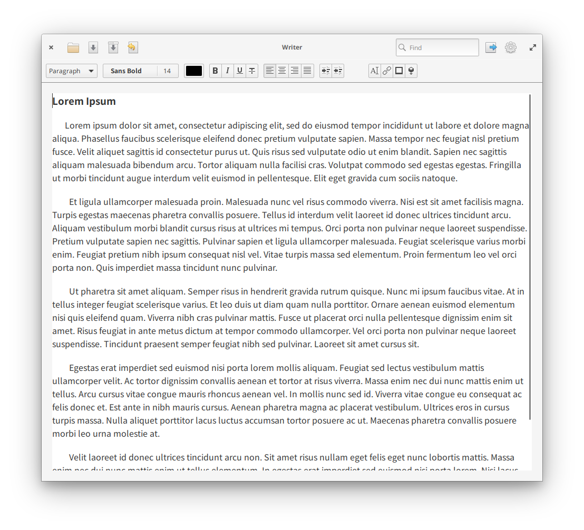

# Writer — The Word Processor of the 21st Century

**Note: this is a work-in-progress app. Some features may not work as expected or have not been implemented yet.**

Writer is a word processor designed for elementary OS that let you create simple and beautiful documents.

## Building, Testing, and Installation

You'll need the following dependencies:

* libgtk-3.0-dev (>= 3.22)
* libgtksourceview-3.0-dev
* libgranite-dev
* libzeitgeist-2.0
* meson
* valac

Clone this repo, run `meson build` to configure the build environment. Change to the build directory and run `ninja` to build

    git clone https://github.com/ryonakano/writer.git && cd writer/
    meson build --prefix=/usr
    cd build/
    ninja

To install, use `ninja install`, then execute with `com.github.ryonakano.writer`

    sudo ninja install
    com.github.ryonakano.writer

## Contributing

Please see [CONTRIBUTING.md](CONTRIBUTING.md).

## The Story Behind This App

Actually this repository is a fork of the [original Writer](https://launchpad.net/writer). One day I found the original one and was very impressed, but it doesn't seems to be updated recently and doesn't released to AppCenter. Then I feel I want to fork it and develop.

So this repository would not exist without the work of the original developers Tuur Dutoit, Anthony Huben and [its mockup designer](https://www.deviantart.com/spiceofdesign/art/Writer-Concept-351501580) spiceofdesign.
